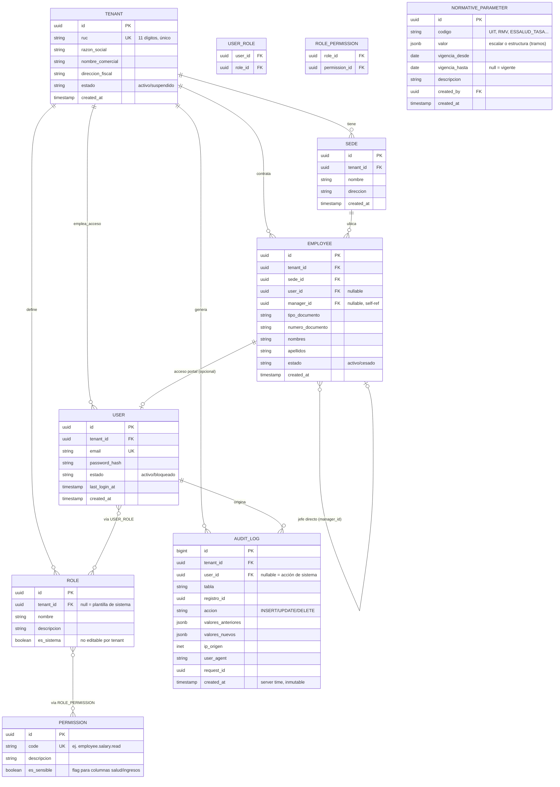

# Fase 0 — Fundaciones: Diseño

**Fecha**: 2026-07-07
**Estado**: Aprobado para pasar a plan de implementación
**Alcance**: primera de cinco fases del proyecto HRMS (ver `goal.md`). Esta fase construye la base común (multi-tenancy, auth, RBAC fila/columna, motor de parámetros normativos, auditoría, plumbing de jobs/storage) sobre la que se apoyan los Módulos 1–4.

## Contexto y alcance

Sistema HRMS multi-tenant real (varias empresas cliente operando simultáneamente desde el lanzamiento) para empresas peruanas, greenfield total (sin sistema previo que migrar). Cada tenant equivale a un solo RUC — un grupo empresarial con varios RUC se modela como tenants separados (no hay jerarquía de "razón social" dentro de un tenant en esta versión).

Fuera de alcance de Fase 0: cualquier lógica de cálculo de nómina, asistencia, documentos o reclutamiento (Módulos 1–4, fases posteriores). Fase 0 entrega únicamente el terreno común.

## Decisiones de arquitectura

| Decisión | Elegido | Alternativas consideradas | Por qué |
|---|---|---|---|
| Backend | NestJS separado | Next.js API Routes | Aislamiento y modularidad por dominio (nómina, asistencia, documentos, ATS) necesarios para un dominio normativo complejo; DI/Guards/Interceptors son donde vive la seguridad fila/columna. |
| Estructura de repo | Monorepo (pnpm workspaces + Turborepo) | Repos separados | Contratos de API y tipos compartidos (Zod) sincronizados en un dominio muy acoplado entre frontend y backend. |
| Infraestructura | Self-hosted / cloud genérico | Supabase (BaaS) | Preferencia explícita del usuario por control propio de Postgres, cola y storage. |
| ORM / aislamiento multi-tenant | Prisma + Row-Level Security de Postgres, activada vía `SET LOCAL app.tenant_id` por transacción | Drizzle + RLS; filtrado solo en aplicación | RLS a nivel de BD hace el aislamiento imposible de romper por un bug de aplicación — no negociable según el goal. Prisma tiene mejor integración con NestJS y tooling ya disponible en el entorno. |
| Seguridad de columna (datos sensibles) | Roles nativos de Postgres (`app_rrhh`, `app_manager`, `app_employee`, `app_admin`) + vistas por rol, reforzado con serialización por grupos en NestJS | Solo capa de aplicación (interceptors) | El goal exige explícitamente enforcement "a nivel de fila y columna en la base de datos, no solo en la UI". |
| Almacenamiento de documentos | MinIO (S3-compatible, self-hosted) detrás de una interfaz `StorageService` | AWS S3 directo | Cumple versionado + cifrado en reposo sin atar el código a un proveedor cloud específico; intercambiable después por hablar el mismo API S3. |
| Cola de jobs | BullMQ sobre Redis | — | Reutiliza el Redis ya requerido para sesiones. |
| Autenticación | Sesiones (Passport `LocalStrategy` + `express-session` con store en Redis) | JWT | El goal pide explícitamente "sesiones con roles RBAC granulares". |

## Arquitectura de carpetas

```
rrhh/
├── apps/
│   ├── web/                    # Next.js 14 (App Router) + TS + Tailwind + shadcn/ui
│   │   └── src/
│   │       ├── app/            # rutas: (auth)/, (dashboard)/planilla, /asistencia, etc.
│   │       ├── components/
│   │       └── lib/            # cliente API, hooks
│   └── api/                    # NestJS
│       └── src/
│           ├── modules/
│           │   ├── auth/               # login, sesiones, guards
│           │   ├── tenants/             # empresas (RUC), sedes
│           │   ├── users/               # usuarios + roles/permisos (RBAC)
│           │   ├── employees/           # esqueleto de trabajador (se extiende en Fase 1)
│           │   ├── normative-params/    # motor de parámetros (UIT, RMV, tasas...)
│           │   └── audit/               # auditoría inmutable
│           ├── common/
│           │   ├── guards/              # TenantGuard, RolesGuard, PermissionsGuard
│           │   ├── decorators/          # @RequirePermission(...)
│           │   └── database/            # Prisma service, middleware tenant/rol
│           └── main.ts
├── packages/
│   ├── shared/                 # tipos TS, esquemas Zod, constantes normativas compartidas
│   ├── database/                # schema.prisma, migraciones SQL (RLS, roles, vistas), seeds
│   └── config/                  # tsconfig, eslint, prettier base
├── docker-compose.yml           # Postgres, Redis, MinIO (dev)
├── pnpm-workspace.yaml
└── turbo.json
```

## Modelo de datos (ER)

Fase 0 construye el esqueleto organizativo, de identidad y de gobierno de datos. Nómina completa (cuentas bancarias, régimen pensionario, salud, etc.) se añade en Fase 1 reutilizando el mismo mecanismo de seguridad de columnas definido aquí.



Decisiones de modelo:

- **`NORMATIVE_PARAMETER` no tiene `tenant_id`**: UIT, RMV, tasas AFP/ONP/EsSalud son normativa nacional, no por empresa. `valor` es `jsonb` para soportar tanto escalares (UIT = 5350) como estructuras (tramos de Quinta Categoría) sin tablas adicionales por tipo de parámetro.
- **`PERMISSION` es catálogo global** (no editable por tenant, vive en código/seed) porque cada permiso corresponde a un guard real en NestJS; `ROLE` sí es por tenant para que cada empresa configure "qué puede hacer cada rol" desde la página de RBAC del Módulo 3.
- **`EMPLOYEE.manager_id`** (auto-referencia) permite la regla obligatoria del goal: "jefe de área no ve datos sensibles de sus reportes" — se resuelve comparando `manager_id` contra el `employee_id` del usuario autenticado.
- **`AUDIT_LOG`** se llena vía triggers de Postgres en las tablas marcadas auditables, no solo por código de aplicación.

## Autenticación, multi-tenancy y RBAC fila/columna

**Autenticación**: sesiones (no JWT). Passport `LocalStrategy` para login → `express-session` con store en Redis → cookie `httpOnly`, `secure`, `sameSite=strict`. Cada sesión guarda `userId` + `tenantId`; login/logout quedan en `AUDIT_LOG`.

**Aislamiento multi-tenant (fila)**: RLS nativa de Postgres. Todas las tablas con `tenant_id` tienen una policy:

```sql
CREATE POLICY tenant_isolation ON employee
  USING (tenant_id = current_setting('app.tenant_id')::uuid);
```

Un `PrismaTenantMiddleware` centralizado envuelve cada request en una transacción interactiva que ejecuta primero:

```sql
SET LOCAL app.tenant_id = '<uuid>';
SET LOCAL app.user_id   = '<uuid>';
```

`SET LOCAL` es transaction-scoped, seguro con connection pooling (PgBouncer en modo transacción). Ningún repositorio necesita filtrar por `tenant_id` a mano — la BD lo garantiza aunque el código de aplicación tenga un bug.

**Seguridad de columna (salud/ingresos)**: roles nativos de Postgres (`app_rrhh`, `app_manager`, `app_employee`, `app_admin`) sin `SELECT` directo sobre columnas sensibles de las tablas base. Cada rol restringido consulta a través de una vista (p. ej. `employee_view_manager`) que omite/enmascara esas columnas; RRHH/Admin usan la tabla base o una vista completa. El mismo middleware añade `SET LOCAL ROLE app_manager;` según el rol efectivo del usuario, mapeado desde `ROLE`/`PERMISSION` de la app hacia el rol físico de Postgres. Este mecanismo se extiende en Fase 1 cuando aparezcan las columnas reales de remuneración.

**Capa NestJS (defensa en profundidad, no la única barrera)**:

- `@RequirePermission('employee.salary.read')` + `PermissionsGuard`: bloquea el endpoint si el usuario no tiene el permiso.
- Serialización con `class-transformer` groups: red de seguridad adicional por si un DTO expone un campo que no debería salir en la respuesta.

Las políticas de RLS y las vistas solo se ejercitan contra Postgres real — los tests de integración de Fase 0 deben correr contra un Postgres de Docker (no mocks) para validar aislamiento entre tenants y bloqueo de columnas.

## Motor de parámetros normativos

Servicio central `NormativeParameterService.resolve(codigo, fecha)`: busca en `NORMATIVE_PARAMETER` el registro cuyo rango `[vigencia_desde, vigencia_hasta)` cubre `fecha`, nunca "el último valor". Recalcular la planilla de marzo en diciembre debe usar la UIT de marzo, no la vigente hoy.

- **Nunca se sobreescribe un parámetro**: actualizar UIT/RMV/tasas es cerrar la vigencia del registro anterior (`vigencia_hasta = nueva_fecha - 1`) e insertar uno nuevo. El historial completo queda preservado.
- **Cacheado por periodo**: durante un cierre de planilla masivo, el mismo parámetro se resuelve miles de veces (una por trabajador); se cachea en memoria por `(código, periodo)` durante la ejecución del job, invalidado al escribir un nuevo parámetro.
- **Escritura restringida**: solo un permiso específico (`normative_param.write`, típicamente Admin) puede crear versiones nuevas — la propia escritura queda auditada.
- **Seed inicial**: en Fase 0 se cargan los parámetros conocidos (UIT, RMV, EsSalud 9%, tasas ONP/AFP por administradora, tramos de Quinta Categoría) con valores de referencia; su uso real en cálculos llega en Fase 1.

## Auditoría inmutable

Un único trigger genérico de Postgres (`audit_trigger()`) se adjunta a `AFTER INSERT OR UPDATE OR DELETE` en cada tabla marcada auditable (`EMPLOYEE`, `USER`, `ROLE`, `ROLE_PERMISSION`, `NORMATIVE_PARAMETER`, y en fases futuras `MARCACION`, `NOMINA`, etc.). El trigger lee `current_setting('app.user_id')`, `app.tenant_id`, `app.request_id` — las mismas variables de sesión que fija el middleware de auth/tenancy — y `app.ip_origen`/`app.user_agent` (fijadas por un interceptor de NestJS al inicio de cada request). Captura `row_to_json(OLD)`/`row_to_json(NEW)` para el diff completo.

`AUDIT_LOG` es verdaderamente append-only a nivel de BD: se revoca `UPDATE`/`DELETE` a todos los roles de aplicación, incluido `app_admin`. Este mismo mecanismo es la base que reutiliza el Módulo 2 para las marcaciones de asistencia append-only con hash encadenado.

## Jobs asíncronos y almacenamiento (plumbing, no los jobs en sí)

**Cola**: BullMQ sobre Redis (reutiliza el Redis de sesiones). Fase 0 entrega el módulo `QueueModule` de NestJS con la conexión, un `Processor` de ejemplo y el patrón para registrar jobs. Los jobs pesados reales (cierre de planilla, firma masiva, generación de archivos SUNAT) se implementan en sus respectivas fases.

**Almacenamiento de documentos**: MinIO (S3-compatible, self-hosted) para dev y producción propia, detrás de una interfaz `StorageService` (upload, download, getSignedUrl) para que el proveedor sea un detalle de infraestructura. Fase 0 solo aprovisiona el bucket (versionado + cifrado en reposo activados) y la interfaz; el módulo de Legajo Digital (Módulo 3) es quien lo usa de verdad.

## Estrategia de testing

- **Unitarias (Jest)**: lógica de servicios (resolución de parámetros normativos por vigencia, agregación de permisos por usuario) con Prisma mockeado.
- **Integración contra Postgres real** (docker-compose en CI, no mocks): no negociable para RLS/vistas — se verifica que una query directa con el rol `app_manager` jamás devuelve columnas sensibles, y que ninguna combinación de filtros permite leer filas de otro `tenant_id`.
- **E2E (supertest)**: fixtures multi-tenant sembradas (2+ empresas, jefe con reportes) validando el caso obligatorio del goal — un jefe de área autenticado que golpea el endpoint de un reporte directo nunca recibe sus campos de salud/ingresos.

## Fuera de alcance (deuda técnica reconocida para fases posteriores)

- Ficha de Alta de Trabajador completa (régimen laboral, cuenta bancaria, asignación familiar) — Fase 1.
- Cualquier cálculo de nómina, beneficios sociales o impuestos — Fase 1.
- Marcaciones de asistencia, geofencing, horas extras — Fase 2.
- Firma digital, legajo documental, portal ESS — Fase 3.
- ATS y parsing de CVs con IA — Fase 4.
- Valores reales y actualizados de UIT/RMV/tasas para el periodo vigente en producción (Fase 0 usa valores de referencia en el seed; deben confirmarse antes de ir a producción).
