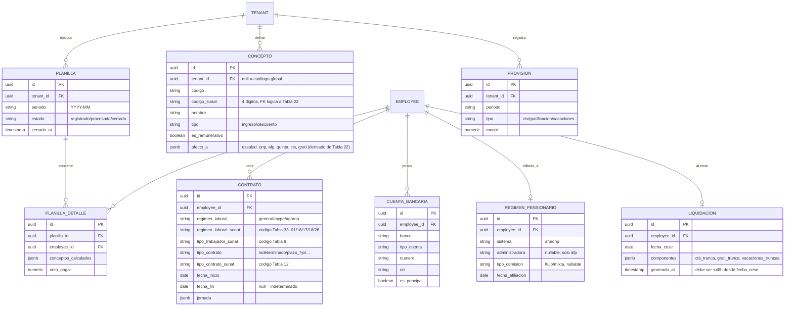
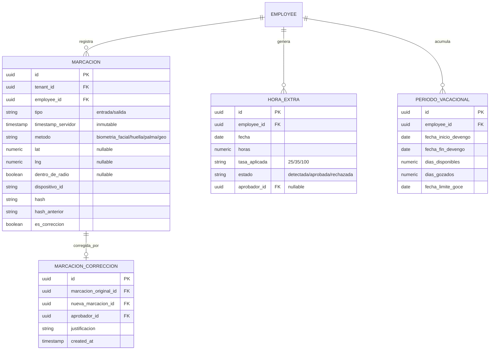
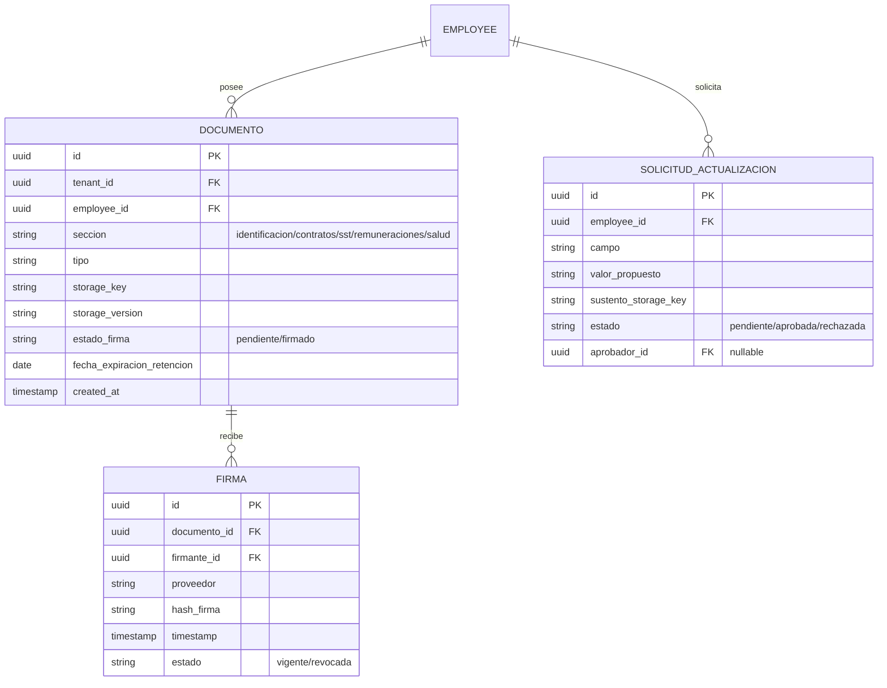
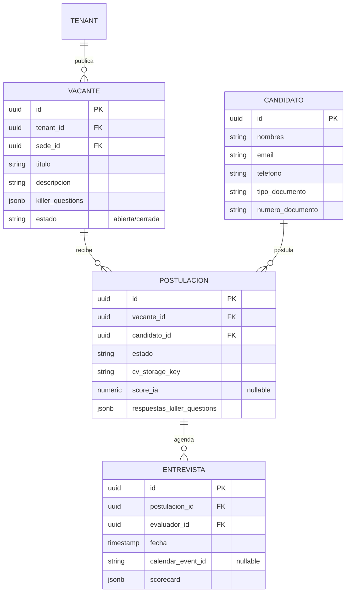

# Especificaciones por Fase — HRMS Perú

Documento vivo. Se actualiza a medida que se completa el diseño de cada fase. No duplica el detalle de Fase 0 (ver archivo propio); a partir de Fase 1 cada fase se documenta aquí mismo.

## Progreso

| Fase | Módulo | Estado | Referencia |
|---|---|---|---|
| 0 | Fundaciones | ✅ Completo (aprobado) | `2026-07-07-fase0-fundaciones-design.md` |
| 1 | Nómina | ✅ Completo (borrador para revisión) | Sección abajo + `anexo2-tablas-parametricas.md` + `anexo3-estructuras-archivos.md` |
| 2 | Asistencia | ✅ Completo (borrador para revisión) | Sección abajo |
| 3 | Documental y Firma | ✅ Completo (borrador para revisión) | Sección abajo |
| 4 | ATS | ✅ Completo (borrador para revisión) | Sección abajo |

**Puntos abiertos que requieren decisión del usuario antes de implementar** (no bloquean el plan de Fase 0, sí bloquean partes puntuales de fases posteriores — ver cada sección):

1. ~~Layout exacto y vigente del PVS SUNAT para T-Registro/PLAME (Fase 1)~~ — **Cerrado (2026-07-10).** El layout oficial completo (31 estructuras de archivo + 34 tablas paramétricas del Anexo 2/Anexo 3 SUNAT) está documentado en `anexo3-estructuras-archivos.md` y `anexo2-tablas-parametricas.md`. Pendiente únicamente confirmar vigencia normativa puntual de tasas/códigos al momento de implementar (el anexo cita fechas de entrada en vigencia entre 2012 y 2023).
2. Proveedor de certificados de firma digital acreditado en Perú (Fase 3) — implica contrato comercial, no una decisión puramente técnica.
3. Proveedor(es) de biometría (facial/huella/palma) a integrar (Fase 2) — decisión de hardware/vendor.
4. Portales de empleo externos a integrar vía multiposting (Fase 4) — depende de qué convenios/API keys existan.

---

## Fase 1 — Módulo 1: Nómina (Cumplimiento y Nómina)

### Contexto y alcance

Corazón del sistema (según el goal, "sin esto nada más tiene valor"). Empieza por régimen General, luego MYPE; Agrario y otros quedan con estructura extensible pero sin implementación completa de reglas. Se apoya en las fundaciones de Fase 0: RLS multi-tenant, RBAC fila/columna, `NormativeParameterService`, `AUDIT_LOG`, `QueueModule` (BullMQ).

Fuera de alcance de Fase 1: marcaciones reales de asistencia (Fase 2) — las horas extra se modelan como un concepto variable que un job de nómina puede leer, pero su origen real (detección automática) llega en Fase 2; firma digital de boletas (Fase 3, en esta fase las boletas son PDF sin firma); ATS (Fase 4).

### Decisiones de arquitectura

| Decisión | Elegido | Por qué |
|---|---|---|
| Motor de cálculo | Servicios puros sin efectos secundarios (`CtsCalculator`, `GratificacionCalculator`, etc.), orquestados por `PayrollRunService` | Testeables unitariamente sin BD ni mocks pesados; cada regla normativa es una función `(inputs, parametros_vigentes) => resultado`. |
| Conceptos remunerativos | Catálogo parametrizable (tabla `CONCEPTO`), no columnas fijas | Cada tenant puede tener bonos/asignaciones propias sin migración de esquema; cada concepto declara a qué tributos/aportes está afecto. |
| Exportación PLAME / T-Registro | Patrón `PlanillaExporter.export(periodo): Buffer`, implementado contra el layout oficial confirmado (ver `anexo3-estructuras-archivos.md`): genera E4+E5+E11+E30 para altas de T-Registro y E14+E15+E18+E26 como mínimo para el PLAME mensual | El layout ya no es una interpretación: es el oficial vigente del PVS SUNAT (Anexo 2/3, jul-2023 con actualización jun-2026). El motor sigue siendo extensible a las 31 estructuras porque no todas aplican al alcance General+MYPE de Fase 1. |
| Exportación bancaria (telecrédito) | Patrón `BankFileExporter`, primera implementación BCP | Igual razón: arquitectura extensible a otros bancos sin tocar el core. |
| Cierre de planilla | Job asíncrono (BullMQ) transaccional: valida → calcula → genera boletas/provisiones → marca periodo `Cerrado` | Operación pesada (todos los trabajadores de un tenant); debe ser atómica y reintentable. |

### Modelo de datos (extensión ER sobre Fase 0)

### Layout oficial SUNAT (T-Registro / PLAME)

Documentado íntegramente a partir de los anexos oficiales provistos por el usuario:

- **`anexo3-estructuras-archivos.md`** — las 31 estructuras de archivo `.txt` (delimitado por `|`) que acepta el PVS de SUNAT, campo por campo, clasificadas en T-Registro (altas/bajas/modificaciones), Derechohabientes y PLAME (planilla mensual). Incluye notas de implementación concretas para `PlanillaExporter`/`BankFileExporter`: qué combinación mínima de estructuras genera un alta completa (E4+E5+E11+E30) y qué combinación mínima genera el PLAME mensual (E14+E15+E18+E26).
- **`anexo2-tablas-parametricas.md`** — las 34 tablas de códigos que referencian esas estructuras (tipo de documento, régimen laboral, régimen pensionario, tipo de contrato, y el catálogo completo de 339 conceptos remunerativos/tributos/descuentos de la Tabla 22). Las tablas pequeñas están transcritas íntegras; los catálogos grandes (UBIGEO, ocupaciones, instituciones educativas, organizaciones sindicales — decenas de miles de filas en total) se exportaron completos como CSV en `docs/seed-data/`, listos para cargar como datos semilla.

Consecuencia directa en el modelo de datos: `CONCEPTO.codigo_sunat` mapea 1:1 a la Tabla 22 (de donde se deriva `afecto_a` mecánicamente en vez de mantenerlo a mano); `CONTRATO.regimen_laboral_sunat`/`tipo_contrato_sunat`/`tipo_trabajador_sunat` guardan los códigos oficiales porque varias reglas de validación del PVS (qué campos aplican, qué conceptos son válidos) están indexadas por esos códigos y no por nuestro enum interno — notablemente, "MYPE" en nuestro dominio corresponde a dos códigos SUNAT distintos (16 microempresa, 17 pequeña empresa) que deben preservarse para la exportación.

### Procesos y reglas de cálculo

Todas las tasas/tramos/topes citados abajo son **parámetros vigentes por fecha** (`NormativeParameterService.resolve`), nunca constantes en código. Los porcentajes mencionados son valores de referencia conocidos de la normativa peruana; deben confirmarse vigentes antes de producción (ver "Puntos abiertos").

1. **CTS**: remuneración computable = sueldo + 1/6 de la gratificación del semestre que corresponde. Depósitos: mayo (cubre nov–abr) y noviembre (cubre may–oct), proporcional a meses y días completos trabajados en el semestre. Liquidación trunca al cese: proporcional desde el último depósito hasta `fecha_cese`.
2. **Gratificación**: sueldo computable = sueldo + asignación familiar + conceptos remunerativos regulares del semestre. Monto = sueldo computable × (meses completos trabajados en el semestre / 6). Más **bonificación extraordinaria 9%** (Ley 30334) sobre el monto de gratificación (6.75% si el trabajador está afiliado a EPS en vez de EsSalud).
3. **Utilidades**: renta neta × tasa por sector (parametrizable: industria, comercio/servicios, otros), distribuida 50% en función de días laborados y 50% en función de remuneración percibida en el ejercicio, con tope de 18 remuneraciones mensuales por trabajador.
4. **Liquidación de beneficios truncos** (dentro de 48h desde el cese): CTS trunca + gratificación trunca + vacaciones truncas (proporcional a meses/días desde el inicio del periodo vacacional vigente) + conceptos pendientes de pago.
5. **Renta de Quinta Categoría**: proyección anual = remuneración proyectada restante del ejercicio + conceptos ya pagados en el año (incluye ingresos de otras entidades si el trabajador los declaró) − 7 UIT de deducción fija. Se aplican tramos progresivos parametrizados (jsonb en `NORMATIVE_PARAMETER`). Retención mensual = impuesto anual proyectado / meses restantes del ejercicio; se recalcula cada mes con la proyección actualizada.
6. **AFP**: aporte obligatorio (10% parametrizable) + comisión (flujo sobre remuneración o mixta sobre saldo, según `REGIMEN_PENSIONARIO.tipo_comision`) + prima de seguro (tasa parametrizable, con tope de remuneración máxima asegurable).
7. **ONP**: 13% (parametrizable) sobre remuneración, sin tope.
8. **EsSalud / EPS**: 9% a cargo del empleador (no es descuento al trabajador); tasa reducida si el tenant tiene convenio EPS (parametrizable).
9. **Asignación familiar**: 10% de la RMV vigente si el trabajador tiene hijos/dependientes declarados.
10. **Exportación T-Registro / PLAME**: `PlanillaExporter` genera `.txt` con log de validación por registro (trabajadores sin cuenta bancaria, sin régimen pensionario, montos atípicos se reportan antes de permitir el cierre).
11. **Telecrédito**: `BankFileExporter` (BCP) genera archivo de pago masivo de haberes/beneficios a partir de `PLANILLA_DETALLE` cerrada.

### Estrategia de testing

Casos borde obligatorios (del goal, no negociables): ingreso a mitad de mes, cese antes del depósito de CTS, trabajador con remuneración variable, régimen MYPE vs General. Cada función de cálculo tiene tests unitarios con `NORMATIVE_PARAMETER` fijados como fixtures (sin BD). Test de integración de un ciclo completo (`Registrado → Procesado → Cerrado`) contra Postgres real, verificando `PLANILLA_DETALLE`, `PROVISION` generados y `AUDIT_LOG` poblado. Test de `LIQUIDACION` verificando que se genera en menos de 48h simuladas desde el cese.

### Fuera de alcance

Reglas completas de régimen Agrario y otros regímenes especiales (solo General + MYPE a fondo). Vigencia normativa de tasas/tramos citados como valores de referencia (punto abierto #1 de layout ya cerrado — ver `anexo2-tablas-parametricas.md`/`anexo3-estructuras-archivos.md`; pendiente de confirmar valores numéricos, ver `validaciones-normativas-pendientes.md`). Origen automático de horas extra (Fase 2 las alimenta; Fase 1 solo sabe consumir el concepto ya aprobado).

---

## Fase 2 — Módulo 2: Control de Asistencia y Gestión del Tiempo

### Contexto y alcance

Blindaje ante SUNAFIL (D.S. 004-2006-TR). Se apoya en el patrón append-only + hash encadenado ya usado por `AUDIT_LOG` en Fase 0, y alimenta a la nómina de Fase 1 (horas extra) vía un concepto variable.

Fuera de alcance: integración real con hardware biométrico (queda como interfaz pluggable — punto abierto #3); notificaciones push a apps móviles (solo se modela el dato, no la app móvil en sí).

### Decisiones de arquitectura

| Decisión | Elegido | Por qué |
|---|---|---|
| Marcaciones | Tabla `MARCACION` append-only, `UPDATE`/`DELETE` revocados a nivel de rol de Postgres (igual que `AUDIT_LOG`) | El goal exige inalterabilidad real, no solo a nivel de aplicación. |
| Integridad | Hash encadenado por trabajador: `hash = SHA256(hash_anterior + employee_id + timestamp_servidor + tipo + payload)` | Cualquier alteración retroactiva de una fila rompe la cadena de hashes de todas las posteriores — detectable en auditoría. |
| Corrección de marcaciones | Tabla `MARCACION_CORRECCION` (nunca se edita el original): referencia a la marcación original, aprobador, justificación, y una nueva `MARCACION` con `es_correccion=true` | "Prohibida la edición directa" del goal — toda corrección queda trazada como registro nuevo. |
| Biometría | Interfaz `BiometricProvider` (facial/huella/palma) pluggable; Fase 2 entrega el pipeline de ingesta + un provider mock/manual | Vendor no elegido aún (punto abierto #3); no se debe atar el core a un SDK específico sin decisión del usuario. |
| Geofencing | `SEDE` gana `lat`, `lng`, `radio_metros`; validación por fórmula haversine al momento de la marcación, se registra `dentro_de_radio` como flag informativo | Permite auditar marcaciones fuera de rango sin necesariamente bloquear (útil para personal en campo autorizado). |
| Horas extra | Job diario compara marcación de salida vs horario pactado (`CONTRATO.jornada` de Fase 1) → candidatas en `HORA_EXTRA` (estado `Detectada`) → aprobación del jefe directo (`manager_id`) → al aprobar, se inyecta como concepto variable que `PayrollRunService` de Fase 1 lee al calcular la planilla del periodo | Cumple el flujo exacto del goal: detección automática → validación del jefe → integración automática en nómina. |
| Vacaciones | Tabla `PERIODO_VACACIONAL` + job de alertas (BullMQ, cron) que marca periodos próximos a vencer | Evita indemnización vacacional por vencimiento no advertido. |

### Modelo de datos (extensión ER)

Sobretasas de horas extra parametrizadas en `NORMATIVE_PARAMETER` (25% primeras 2h, 35% siguientes, 100% feriados/descanso), reutilizando el mismo motor de Fase 1.

### Estrategia de testing

Test de integridad de cadena de hash (alterar cualquier fila rompe la verificación de las posteriores). Test que confirma que ningún endpoint permite `UPDATE`/`DELETE` físico sobre `MARCACION` (verificado contra Postgres real, no mock — el rol de aplicación no tiene el privilegio). Tests unitarios de geofencing (haversine) con casos dentro/fuera de radio. Tests de sobretasas de horas extra espejando los casos borde de Fase 1 (feriado, primeras 2h vs siguientes). Test de alerta de vencimiento de periodo vacacional.

### Fuera de alcance

Integración real con hardware/SDK biométrico (punto abierto #3). App móvil de marcación (solo el contrato de datos que consumiría). Notificaciones push.

---

## Fase 3 — Módulo 3: Gestión Documental y Firma Digital Certificada

### Contexto y alcance

Se apoya en `StorageService` (MinIO) y el patrón de auditoría de Fase 0; el RBAC fila/columna de Fase 0 rige qué secciones del legajo puede ver cada rol (Salud/Remuneraciones solo RRHH).

Fuera de alcance: selección e integración real de un proveedor de certificados digitales (punto abierto #2, implica contrato comercial).

### Decisiones de arquitectura

| Decisión | Elegido | Por qué |
|---|---|---|
| Firma digital | Interfaz `DigitalSignatureProvider.sign(documento, certificado): DocumentoFirmado` | El goal pide explícitamente arquitectura con interfaz abstracta para el proveedor; elegir proveedor concreto es una decisión comercial/legal, no puramente técnica (punto abierto #2). |
| Legajo | Secciones fijas (`SECCION_LEGAJO`: Identificación, Contratos, SST, Remuneraciones, Salud) + tabla `DOCUMENTO` con metadata y referencia a objeto en MinIO (bucket/key/versión) | Búsqueda por metadatos sin acoplar la lógica al storage físico. |
| Retención | `DOCUMENTO.fecha_expiracion_retencion` calculada al crear el documento según su sección (Salud = 20 años, resto = 5 años mínimo); un job periódico marca documentos vencidos para revisión humana, **no borra automáticamente** | Riesgo legal de borrado automático incorrecto; el goal pide retención, no destrucción autónoma. |
| Firma masiva | Job asíncrono (BullMQ) que itera un lote de documentos pendientes, invoca el provider, actualiza `estado_firma` y guarda hash de verificación | Volumen (cientos de documentos) requiere procesamiento asíncrono con reintentos. |
| Portal ESS | Endpoints de solo lectura filtrados por el empleado autenticado (mismo RLS/RBAC de Fase 0) + `SOLICITUD_ACTUALIZACION` (mismo patrón que `MARCACION_CORRECCION`: propuesta + sustento + aprobador) | Reutiliza mecanismos ya validados en fases anteriores en vez de introducir uno nuevo. |

### Modelo de datos (extensión ER)

### Estrategia de testing

Test RBAC: un jefe de área autenticado nunca recibe documentos de la sección Salud/Remuneraciones de sus reportes (reutiliza el mecanismo de vistas/roles de Fase 0). Test de workflow de firma masiva end-to-end con provider mock. Test de cálculo de `fecha_expiracion_retencion` por sección. Test de performance del "Expediente de Inspección": exportar 5 años de registros de 1,000 trabajadores en menos de 30 segundos (criterio de aceptación explícito del goal).

### Fuera de alcance

Proveedor de firma digital concreto (punto abierto #2). Multiposting de portales de empleo (Fase 4).

---

## Fase 4 — Módulo 4: Reclutamiento (ATS)

### Contexto y alcance

Portal público (sin tenant autenticado del lado del candidato) + pipeline interno protegido por RBAC de Fase 0. Al marcar un candidato como "Contratado", pre-puebla `EMPLOYEE` y `CONTRATO` (Fase 1) con los datos ya capturados.

Fuera de alcance: integraciones reales con portales de empleo externos y proveedores de pruebas psicométricas (punto abierto #4, dependen de convenios/API keys existentes).

### Decisiones de arquitectura

| Decisión | Elegido | Por qué |
|---|---|---|
| Multiposting | Interfaz `JobBoardConnector.publish(vacante): PostingResult` pluggable; Fase 4 implementa solo el portal corporativo propio | El goal pide diseñar como integraciones plugables e implementar primero el portal propio; no se debe asumir acceso a APIs de terceros sin confirmar qué convenios existen (punto abierto #4). |
| Parsing de CV con IA | Extracción de texto (PDF/DOCX) vía librería estándar, luego prompt estructurado a la API de Anthropic (Claude) con schema Zod para la respuesta (datos extraídos + score semántico contra el perfil de la vacante), ejecutado como job asíncrono | El goal exige explícitamente usar la API de Anthropic; el volumen/latencia del parsing justifica hacerlo async (BullMQ), no en el request de postulación. |
| Pipeline | Tabla `POSTULACION` con estado enum (`Postulado→Entrevista→Seleccionado→Contratado→Rechazado`), cada transición auditada vía `AUDIT_LOG` | Reutiliza el mecanismo de auditoría de Fase 0 en vez de crear uno nuevo. |
| Entrevistas | Interfaz `CalendarProvider` (Google Calendar/Outlook) con OAuth por reclutador | Integración de calendario es un detalle de proveedor intercambiable, igual patrón que `StorageService`/`DigitalSignatureProvider`. |

### Modelo de datos (extensión ER)

### Estrategia de testing

Tests de parsing/scoring con fixtures de CVs de muestra (mock de la API de Anthropic en unitarios; test de integración real es manual/opcional, no en CI por costo y no-determinismo). Test de transición de estados del pipeline con notificaciones mockeadas. Test de pre-población de `EMPLOYEE`/`CONTRATO` al marcar "Contratado", verificando el mapeo exacto de campos entre `POSTULACION`/`CANDIDATO` y las entidades de Fase 1.

### Fuera de alcance

Integraciones reales con portales de empleo externos y proveedores de pruebas psicométricas (punto abierto #4).
